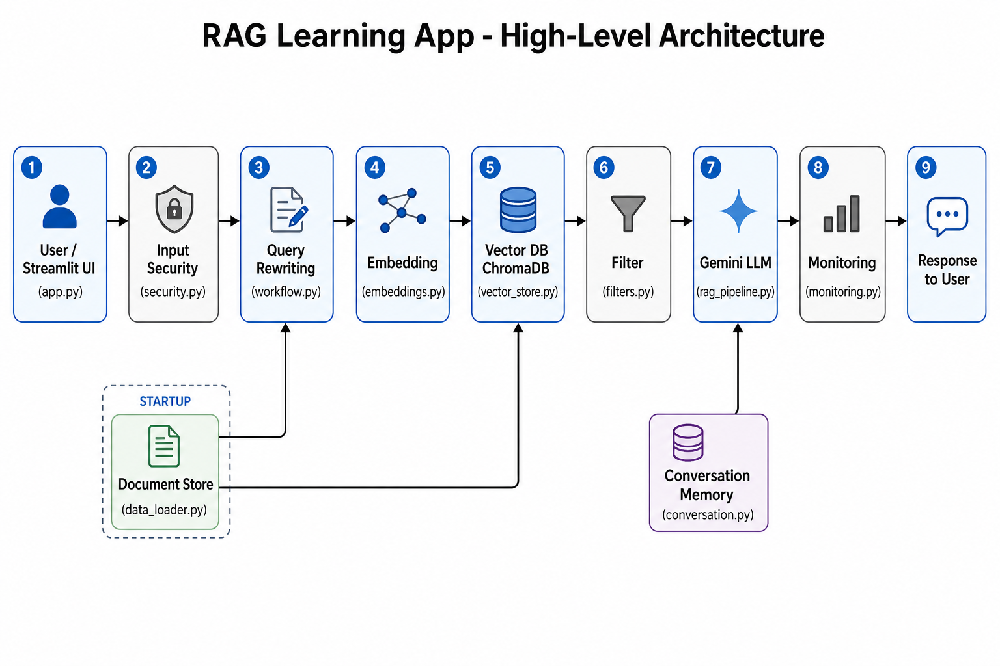

# RAG App — High-Level Architecture

This diagram shows how the major parts of our RAG Learning App connect. It matches the code in this repository (Weeks 10–15).



---

## Component Overview

### 1. User / Streamlit UI (`app.py`)
The user types a question in the browser. Streamlit displays answers, sources, confidence, and grounding results.

### 2. Input Security (`security.py`)
Every query is checked before processing. Empty input, overly long queries, and prompt injection patterns are blocked.

### 3. Query Rewriting (`workflow.py`)
The user's question may be rewritten into a clearer version before search. Conversation history helps resolve vague follow-ups like "What else can it do?"

### 4. Embedding (`embeddings.py`)
Text is converted into vector embeddings using the `all-MiniLM-L6-v2` model. Similar meaning produces similar vectors.

### 5. Vector Database — ChromaDB (`vector_store.py`)
Stored document embeddings are searched to find the closest matches to the query embedding.

### 6. Filtering (`filters.py`)
Documents that are too far from the query (above the similarity threshold) are removed. If nothing relevant remains, a fallback message is returned instead of calling the LLM.

### 7. LLM — Gemini (`rag_pipeline.py`)
The retrieved documents (and conversation history) are sent to Gemini as context. Gemini generates an answer grounded in those documents.

### 8. Monitoring (`monitoring.py`)
After generation, the app calculates a confidence score from retrieval distances and runs an LLM-as-judge check to classify the answer as GROUNDED, PARTIAL, or HALLUCINATED.

### 9. Conversation Memory (`conversation.py`)
Each user question and assistant answer is saved so follow-up questions can include prior context in the next prompt.

---

## Data Flow (Query Path)

```
User Question
    → Streamlit UI
    → Security validation
    → Query rewriting
    → Query embedding
    → ChromaDB retrieval
    → Similarity filtering
    → Gemini answer generation (with context + history)
    → Monitoring (confidence + grounding)
    → Response shown to user
```

---

## Data Flow (Startup / Indexing)

```
Sample documents (data_loader.py)
    → Embed all documents (embeddings.py)
    → Store in ChromaDB (vector_store.py)
```

This indexing runs once when the app starts so the knowledge base is ready for search.

---

## Why this architecture?

- **Retrieve first, then generate** — reduces hallucination by grounding answers in documents
- **Security at the boundary** — bad input is stopped before it reaches the LLM
- **Filter before generate** — off-topic questions get a helpful fallback, not a wrong answer
- **Monitor after generate** — users see confidence and grounding quality
